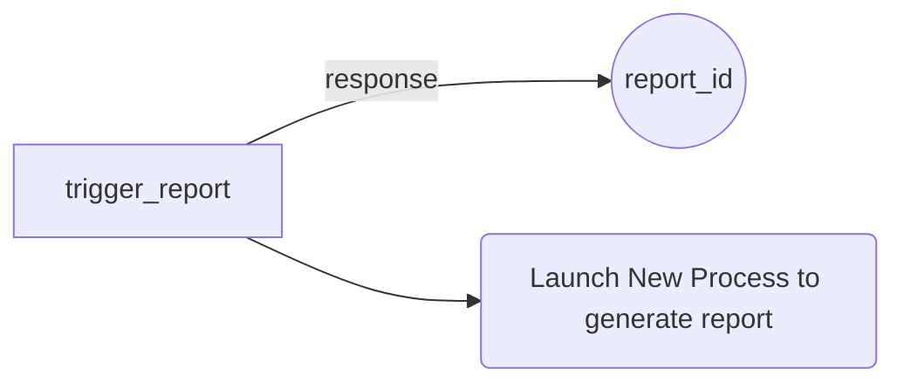
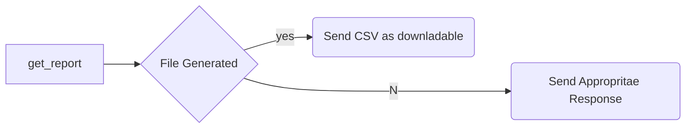

# Thanks for the task - Sankalp Kumar

Database Used - Postgres

## Table Names

- store_activity - From CSV 1
-  store_business_hours - From CSV 2
-  store_timezones - From CSV 3
 - reports - store report_id and it generation status

# Assumptions

 - If no activity data is given for the time we are looking for we assume the status to be same as the activity just before the time
 - If no data assumed active
 - ```/trigger_report``` -  Creates the csv for all store ids (not for single store)

## Logic

 1. `/trigger_report` 
	Create a Random Report id and store it in reports table with generated as false
	Using MultiProcessing we call a function to start generation of the report
	The function is non blocking so the user instantly gets the response
2. `/get_report`
	Checks if input is there in the request or not
	Checks if valid report_id using reports table
	Responds accordingly
	If csv generation is complete send the csv file as downloadable
	The csv is stored in `csvs/` folder, we may prefer using S3 or other alternatives

Code Logic:

 - First we fetch all the unique store_ids from the database
 - Then we create `store`objects for each store ids and call the class methods on it to calculate the report
 - For `last_hour` calculation if current time is 9:03 we calculate the uptime and downtown in between 8:00 to 9:00. Uptime is set to 0 initially. Now we get the store status on or before 8:00. Then iterate through 60 min and add to uptime. We keep checking for change in active/inactive. Is store is closed at that time it is calculated as uptime
 - For `last_day` we broke the previous day in hours and called `last_hour()` for each hour as data present was some random timestamps and not ordered.
 - For `last_week` we broke the week in days and called `last_day()`

	




